# Crypto Wizard Clone - BRAID Functionality Diagram

```mermaid
flowchart TD;
    A[Crypto Wizard Clone - crypto-wizard.tech] --> B[Public Pages];
    A --> C[Auth System - Supabase];
    A --> D[Dashboard Sidebar Layout];
    A --> E[User Role Modules];
    A --> F[Marketplace Features];
    A --> G[Content Sections];
    
    B --> B1[Homepage / Landing Page];
    B --> B2[About Us];
    B --> B3[Contact Us];
    B --> B4[Privacy Terms];
    B --> B5[Donate Page];
    
    C --> C1[Sign Up / Login - already scaffolded];
    C --> C2[Forgot Password];
    C --> C3[Protected Routes];
    C --> C4[Session Management via Supabase SSR];
    
    D --> D1[Left Sidebar Nav];
    D1 --> D1a[Dashboard Link];
    D1 --> D1b[Role Links: Promoter / Influencer / Recruiter];
    D1 --> D1c[Bounties/Ads];
    D1 --> D1d[Scoreboard];
    D1 --> D1e[Earnings];
    D1 --> D1f[Profile];
    D1 --> D1g[Secondary Nav: Narratives / Tools / Directories / Blog / Jobs / Store / Feedback];
    
    E --> E1[Promoter Module];
    E1 --> E1a[Stats Dashboard];
    E1 --> E1b[Influencer Directory];
    E1 --> E1c[Rate and Terms];
    E1 --> E1d[Purchase History];
    
    E --> E2[Influencer Module];
    E2 --> E2a[Stats Dashboard];
    E2 --> E2b[Main Channels];
    E2 --> E2c[Campaign History];
    E2 --> E2d[Rate and Terms];
    E2 --> E2e[Earnings];
    E2 --> E2f[Recruiter Info];
    
    E --> E3[Recruiter Module];
    E3 --> E3a[Stats Dashboard];
    E3 --> E3b[Earnings];
    E3 --> E3c[Referral Link + QR Code];
    
    F --> F1[Store - WizardHat Tech Store];
    F1 --> F1a[Crypto Cards];
    F1 --> F1b[Crypto Hardware];
    F1 --> F1c[Crypto Software / Tools];
    F1 --> F1d[Crypto Phones];
    F1 --> F1e[Product Cards with Price + Seller];
    
    F --> F2[Bounties and Ads];
    F2 --> F2a[Bounty Board - Browse];
    F2 --> F2b[My Active Bounties];
    F2 --> F2c[Completed Bounties];
    F2 --> F2d[Place Bounty - Create];
    
    F --> F3[Scoreboard];
    F3 --> F3a[Top Promoters];
    F3 --> F3b[Top Influencers];
    F3 --> F3c[Top Recruiters];
    
    F --> F4[Earnings Module];
    F4 --> F4a[Current Balance];
    F4 --> F4b[Lifetime Earnings];
    F4 --> F4c[Pending Payouts];
    F4 --> F4d[Withdraw / Payout Settings];
    
    G --> G1[Blog];
    G --> G2[Job Board];
    G --> G3[Directories];
    G3 --> G3a[Discord Server Directory];
    G3 --> G3b[Telegram Groups Directory];
    G3 --> G3c[Onion Sites Directory];
    G3 --> G3d[Crypto Websites Directory];
    G3 --> G3e[Influencer Directory];
    
    G --> G4[Pull Narratives];
    G --> G5[Push Narratives];
    G --> G6[Tools];
    G6 --> G6a[Free Software];
    G6 --> G6b[Free AI Tools];
    G6 --> G6c[Paid Software];
    G6 --> G6d[AI Tools];
    G --> G7[Feedback Page];
    
    A --> H[Profile / Settings];
    H --> H1[Personal Info];
    H --> H2[Payout Methods];
    H --> H3[Linked Accounts];
    H --> H4[Notifications];
    
    A --> I[Tech Stack Constraints];
    I --> I1[Next.js App Router - already set up];
    I --> I2[Supabase Auth + DB];
    I --> I3[TailwindCSS + shadcn/ui];
    I --> I4[Dark theme with purple/blue crypto aesthetic];
    I --> I5[Responsive sidebar layout];
    
    A --> J[Verification Checks];
    J --> J1[All nav links from original site mapped];
    J --> J2[Sidebar matches logged-in layout];
    J --> J3[Store shows product cards with prices];
    J --> J4[Directories show community cards with visit links];
    J --> J5[Mock data for all sections - no real backend needed initially];
```

## Functionality Summary

| Area | Pages | Key Features |
|------|-------|-------------|
| **Public** | Home, About, Contact, Privacy, Donate | Landing page, static content |
| **Auth** | Login, Sign Up, Forgot Password | Already scaffolded with Supabase |
| **Dashboard** | Sidebar layout | Left nav with all role/section links |
| **Promoter** | 4 sub-pages | Stats, directory, rates, purchase history |
| **Influencer** | 6 sub-pages | Stats, channels, campaigns, rates, earnings, recruiter |
| **Recruiter** | 3 sub-pages | Stats, earnings, referral link + QR |
| **Store** | 4 categories | Product cards with price, seller, category |
| **Bounties** | 4 sub-pages | Board, active, completed, place bounty |
| **Scoreboard** | 3 leaderboards | Top promoters/influencers/recruiters |
| **Earnings** | 4 sub-pages | Balance, lifetime, pending, withdraw |
| **Directories** | 5 directories | Discord, Telegram, Onion, Crypto sites, Influencers |
| **Content** | Blog, Job Board, Narratives, Tools, Feedback | Listing pages with cards |
| **Profile** | 4 sub-pages | Info, payout methods, linked accounts, notifications |

**~40+ pages total**, built on the existing Next.js + Supabase + Tailwind + shadcn/ui stack.
